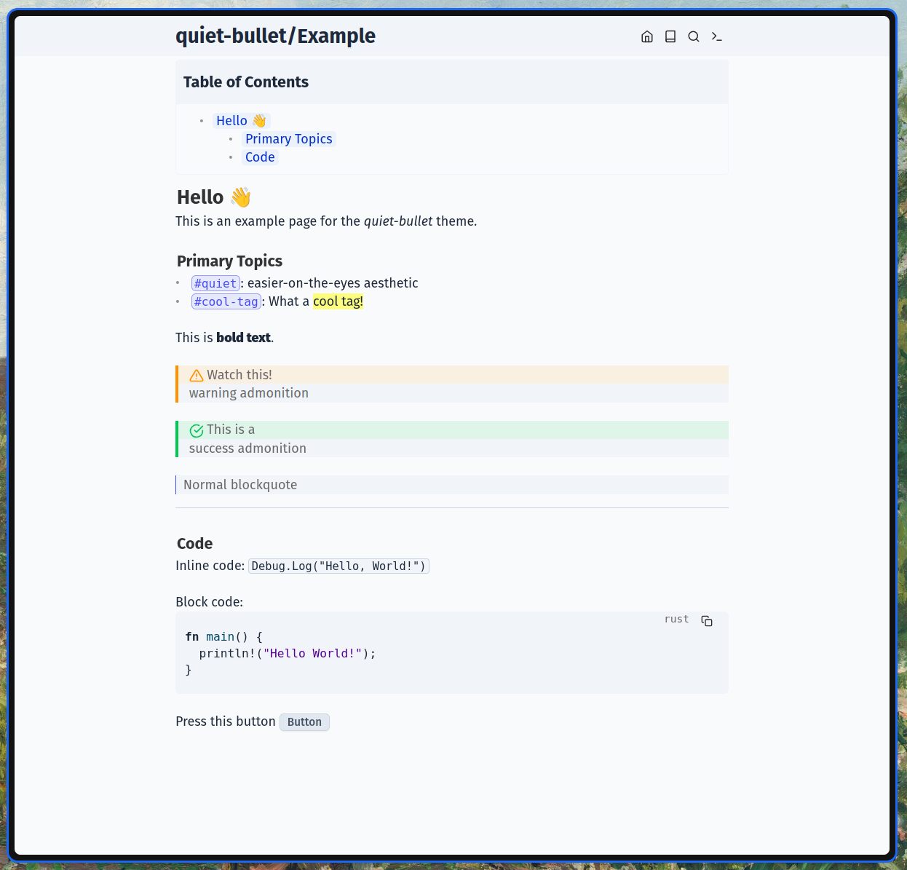

# quiet-bullet
This is a minimal [SilverBullet](https://silverbullet.md/) theme designed for a quieter, easier-on-the-eyes aesthetic.

## Files Structure

| File Name          | Role                                                    | Priority |
|--------------------|---------------------------------------------------------|----------|
| `Configuration.md` | Core variables (Font, Spacing, Radii)                   | 1000     |
| `Palette.md`       | Light/Dark color definitions                            | 900      |
| `Base.md`          | Global resets, typography settings                      | 800      |
| `Editor.md`        | Markdown elements (Links, Tags, Code, Lists, etc.)      | 700      |
| `Interface`        | SilverBullet UI (Top bar, Buttons, Notifications, etc.) | 600      |

## Installation
Install quiet-bullet by either cloning this repository into your space or by moving the files manually. Ensure no other space-style blocks interfere.

## Status
I just started developing this theme and have only changed styles for components I often use. Feel free to enhance this theme. Development is taking place on [Codeberg](https://codeberg.org/) -> [Repo](https://codeberg.org/niko7n/quiet-bullet) and is mirrored to GitHub.

There are open TODOs.

## Thanks
- [@zefhemel](https://github.com/zefhemel) for Silverbullet.md
- [@mschmidtkorth](https://github.com/mschmidtkorth) for [silverbullet-zen](https://github.com/mschmidtkorth/silverbullet-zen/blob/main/ZEN_THEME.md) as it helped greatly finding all the required css variabels.
