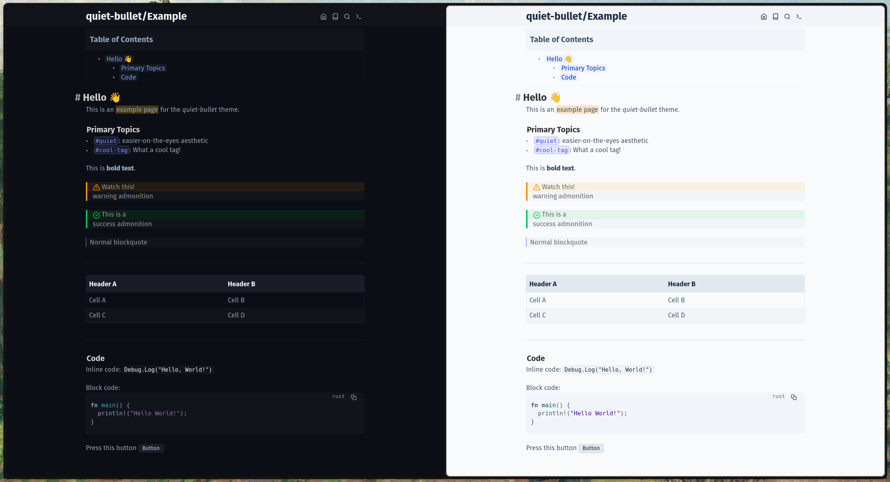

# quiet-bullet 🤫
A minimal, easier-on-the-eyes theme for [SilverBullet](https://silverbullet.md/) (V2).

## Files Structure | Configuration
To ease the customization of this theme, the `space-style` is split across several files. 

| File Name          | Role                                                    | Priority |
|--------------------|---------------------------------------------------------|----------|
| `Configuration.md` | Core variables (Font, Spacing, Radii)                   | 1000     |
| `Palette.md`       | Light/Dark color definitions                            | 900      |
| `Base.md`          | Global resets, typography settings                      | 800      |
| `Editor.md`        | Markdown elements (Links, Tags, Code, Lists, etc.)      | 700      |
| `Interface`        | SilverBullet UI (Top bar, Buttons, Notifications, etc.) | 600      |

## Installation
Simply clone this repository into your space or copy the files manually. Done :)

## Status & Contribution
Currently in active early development. I am prioritizing the components I use most frequently in my daily workflow.

Feedback and Contributions are welcome! Development happens on [Codeberg](https://codeberg.org/niko7n/quiet-bullet) and is mirrored to [GitHub](https://github.com/niko7n/quiet-bullet). Please feel free to open an issue or submit a PR if you find a UI element that needs a "quiet" touch.

## Acknowledgments
- [@zefhemel](https://github.com/zefhemel) for creating [SilverBullet](https://silverbullet.md)
- [@mschmidtkorth](https://github.com/mschmidtkorth) for [silverbullet-zen](https://github.com/mschmidtkorth/silverbullet-zen/blob/main/ZEN_THEME.md) as it helped finding all the required css variabels.
